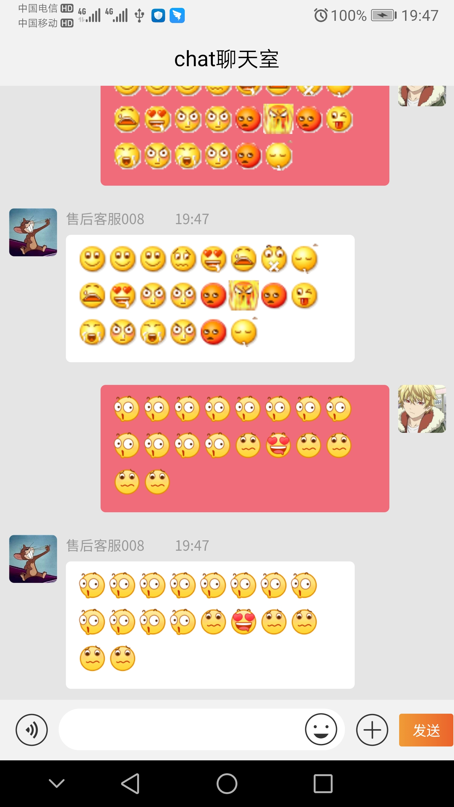

# uniapp-chatRoom

#### 介绍
基于 '回梦無痕' 作者的 《聊天模板》 添加的表情轮播组件

###### 继上个版本之后，集成到了这个聊天模板上,虽然效率还存在卡顿现象，但是经过简单测试,把代码中的console.log() 和 uni.showToast()方法全部注释掉以后,执行效率有所提高

#### 软件架构
### 效果图1

### 效果图2

#### 安装教程

1.  xxxx
2.  xxxx
3.  xxxx

#### 使用说明

1.  xxxx
2.  xxxx
3.  xxxx

